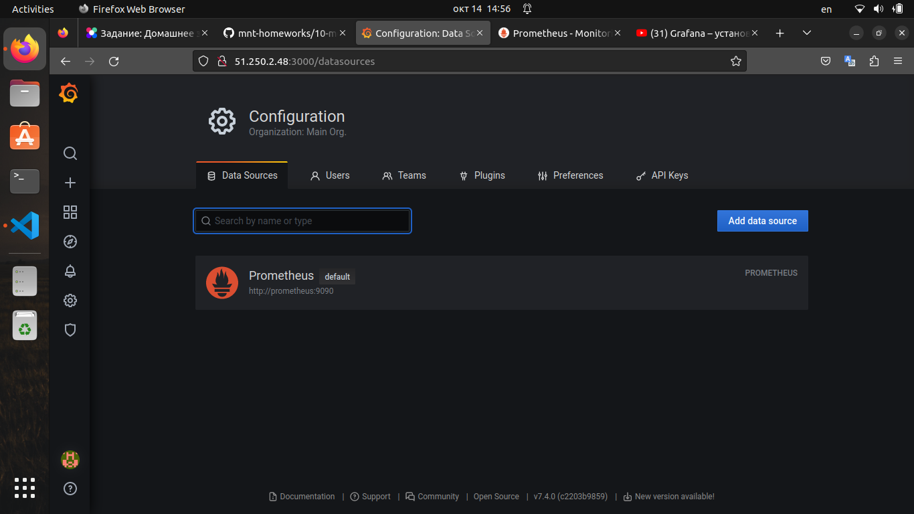
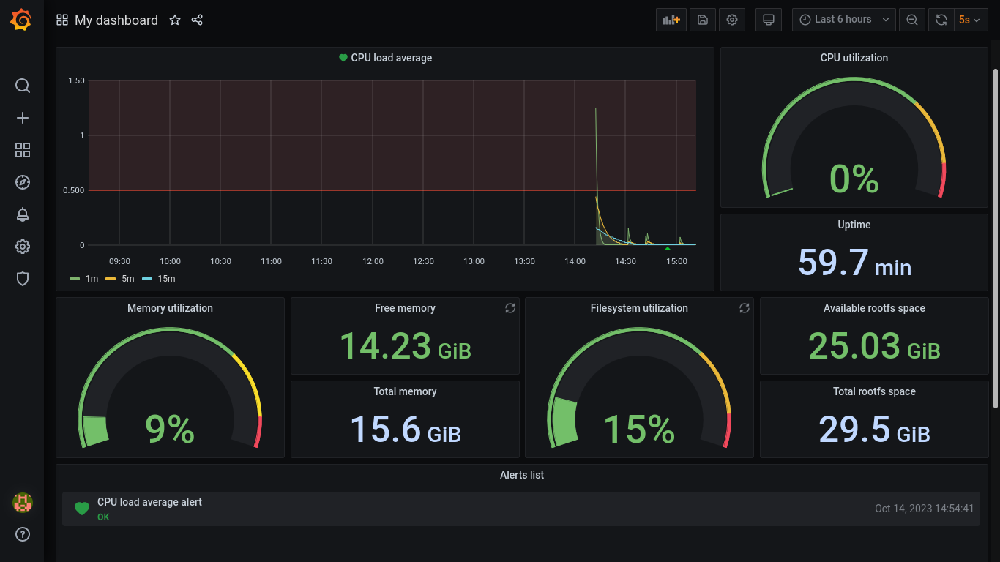

# 10-monitoring-03-grafana

## Задание 1. Настройка Datasource



## Задание 2. Настройка dashboard


### 2.1 CPU utilization:

```
100 - (avg (rate(node_cpu_seconds_total{job=~"nodeexporter",mode="idle"}[1m])) * 100)
```

### 2.2 Free memory:

```
node_memory_MemFree_bytes{job=~"nodeexporter"}
```

### 2.3 Load average:

```
avg(node_load1{job=~"nodeexporter"})
avg(node_load5{job=~"nodeexporter"})
avg(node_load15{job=~"nodeexporter"})
```

### 2.4 Available FS space:

```
node_filesystem_avail_bytes{job=~"nodeexporter",mountpoint="/",fstype!="rootfs"}
```

## Задание 3. Alerts



## Задаине 4. JSON-модель dashboard

[Config datasource](./files/dashboard.json)